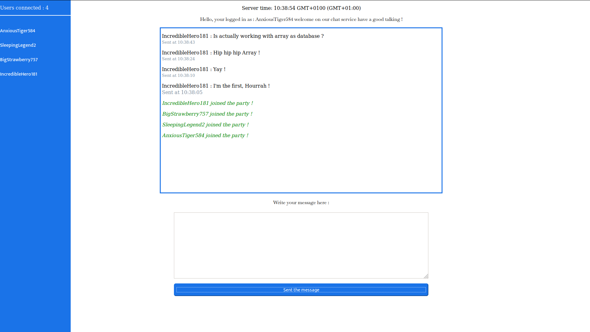

# Heroku-socket - Emissions

<p> :warning: A little thing I will let you know, <b>if you have not followed the construction guide of the starting environment, and you have download the repository </b>, you can skip the sections concerning Heroku, and above all do not forget to make a <b>npm install </b> in the root of the directory to install the dependecies of our project.</p>


<hr>


<h3>  :notebook: purpose of this branch </h3>

<p>On this branch we will take care of the following points : </p>

<p><i> :memo: Rewriting template indent and style. </i></p>

<p><i> :memo: Receive messages on server.</i></p>

<p><i> :memo: Secure all messages, and add a date for every messages sent. </i></p>

<p><i> :memo: Broadcasting every messages by rewriting the dom. </i></p>

<p><i> :memo: And finally, deploy our change on Heroku. </i> </p>

<p> Welcome on this branch, we gonna write the most importants functions of our applications, and also redefining a little bit our template elements organisation.</p>

<h3>  :question:  How it works ? </h3>

<hr>

<p>It's really easy, we listen to a message from an user, and we gonna use <b> ent </b> a new package that allow us to secure message from malicious javascript insertion on server.</p>

<p>When the message is receveived securely we use array to keep an eye on the 100 last messages, then we can show to an user who just has come what is been saying in the 100 messages before his connection, sound good right ?</p>

<p>A last thing, we want to create a date for each messages, and when we got all of this,<br> we want to broadcast a rewriting of the DOM for each users connected. </p>

<p>So let's code !, my entire folder and the files which is contain is actually the same from the branch name : <a href="https://github.com/R3tr093/Heroku-socket/tree/emissions">emissions</a></p>


<h3>  :construction_worker: Build and Build</h3>

<p>Okay, so now we know what we want to do, and for that we have to create a new area in our html template, so open <a href="index.html">index.html</a></p>

<p>I have added some update in our template, i don't gonna explain this, is just my choice of template and it doesn't have impact in our socket.io practice. </p>

``` html


<html>

    <head>

        <link href="index.css" rel="stylesheet" type="text/css" >
        <link href="bootstrap-4.3.1-dist/css/bootstrap-grid.min.css" rel="stylesheet" type="text/css">
        <link href="https://fonts.googleapis.com/css?family=Baskervville|Mukta:500&display=swap" rel="stylesheet"> 
        
    </head>

  <body>

    <div class="d-none d-md-block" id="usersList">

        <p id="amountUsers"></p>

    </div>
    

    <div class="container">
          
      <div class="row">
           

      
            <div class="col-lg-10 col-md-12 col-xs-12 col-sm-12" id="main">
               
                <p id='server-time'></p>
      
                <p id="serverMessages"></p>

                

                <div id="chat">

                </div>
             
                
                <div id="userFrame">

                  <br>
                  <label for="textArea">Write your message here : </label>
                  <br><br>
                  <textarea class="form-control" id="textArea" rows="3"></textarea>
                  <button type="button" class="btn btn-primary btn-lg btn-block" id="sentBtn">Sent the message</button>

                </div>

                
      
            </div>

      
      </div>
  
    </div>

  
    <!-- JAVASCRIPT -->
    
    <script src="/socket.io/socket.io.js"></script>
    <script src="client.js"></script>
  
</body>
</html>


```

<p> And surprise theses new changes on our template come with new changes for our <b>css</b> too ! Nothing really important to explain there too, I just give the code who setting my template for let you working on the same view than me.</p>

``` css

body
{
    margin: 0px;
    height: 100vh;
    overflow: hidden;
    display: flex;
}

#main
{
  
 
  text-align: center;

}

#usersList
{
    width: 12%;
    height: 100vh;
    color: white;
    overflow-y: auto;
    background: #1a73e8;
   


}

#amountUsers
{
    margin-top: 0px;
    border-bottom : 2px solid white;
    height: 50px;
    padding-top: 15px;
    padding-bottom: 15px;
}

.ell
{
    font-size: normal;
    word-break: break-word;
    font-family: 'Mukta', sans-serif;
}
.ell:hover
{
    font-size: large;
    cursor: pointer;
    word-break: break-word;
}

#serverMessages
{
    font-family: 'Baskervville', serif;
}

.userMessages
{
    text-align: left;
}

p.infoOn
{
    text-align: left;
    font-style: italic;
    color: green;
}

p.infoOff
{
    text-align: left;
    font-style: italic;    
    color: red;

}

label
{
    font-family: 'Baskervville', serif;
}


textarea
{
    max-width: 90%;
    width: 90%;
    min-width: 90%;
    margin: 5%;
    margin-top: 3px;
    height: 20vh;
    max-height: 20vh;
    padding: 8px;
}

#sentBtn
{
    background-color: #1a73e8;
    color: white;
    text-align: center;
    width: 90%;
    position: relative;
    top: -30px;
    padding-bottom: 10px;
    padding-top: 10px;
    border-color:  #1a73e8;
    border-radius: 6px;

}

#sentBtn:hover
{
    background-color: #1a73e8;
    color: white;
    box-shadow: 1px 2px 1px 2px lightgray;
    text-align: center;
    width: 90%;
    position: relative;
    top: -30px;
    padding-bottom: 10px;
    padding-top: 10px;
    cursor: pointer;
    -webkit-box-shadow: 10px 10px 73px -17px rgba(0,0,0,0.75);
    -moz-box-shadow: 10px 10px 73px -17px rgba(0,0,0,0.75);
    box-shadow: 10px 10px 73px -17px rgba(0,0,0,0.75);

}

.messages
{
    text-align: left;
    margin-bottom: 2px;
    
}

.msgDates
{
    font-size: small;
    text-align: left;
    color: lightslategray;
    margin-top: 0px;

}

.msgDates:hover
{
    font-size: 16px;
    cursor: pointer;
    text-align: left;
    color: lightslategray;
    margin-top: 0px;

}

#chat
{
    min-height: 45vh;
    height: 50vh;
    max-height: 55vh;
    overflow-y: auto;
    border: 3px solid #1a73e8;
    padding-left: 4px;


}


```

<p>Here we are, i'm gonna explain and show you all the code we did for making this chat service really working. </p>

<p>Let's begin by the <a href="client.js" target="_blank">client.js</a></p>


<h3> client.js</h3>
<hr>

``` javascript

var socket = io();


var el = document.getElementById('server-time');

let getMessage = document.getElementById('sentBtn');

let userName;

// SERVER EVENTS

// Display server time
socket.on('time', function(timeString) {
    el.innerHTML = 'Server time: ' + timeString;
});

socket.on('hello', function(message){
  document.getElementById('serverMessages').textContent = "" + message;
  
})

// Get the pseudo of the client from the server.
socket.on('newUser', function(userName) {
  console.log(userName);
})

// LogOn && logOff refresh list of user, and amount of user, display a message who said an user has been connected or disconnected to everyone

socket.on('logOn', function(count) {
  
  let info = document.createElement("p");
  
  info.setAttribute("class", "infoOn");
  
  userName = count.content;

  info.textContent = count.content + " joined the party !";
  
  document.getElementById("chat").prepend(info)
  
  document.getElementById('amountUsers').textContent = "Users connected : " + count.amount;
  
  let result = ""

  for (let i = 0; i < count.users.length; i++) {
    
    result = result + "<br><span class='ell'>"+ count.users[i] + "</span><br>";
    
  }

  document.getElementById("usersList").innerHTML = "<p id='amountUsers'> Users connected : " + count.amount + "</p>" + result;

})

socket.on('logOff', function(userName) {

  let info = document.createElement("p");
  
  info.setAttribute("class", "infoOff");
  
  info.textContent = userName.content + " Has been disconnected.";

  document.getElementById("chat").prepend(info)
  
  document.getElementById('amountUsers').textContent = "Users connected : " + userName.amount;
  
  let result = ""

  for (let i = 0; i < userName.users.length; i++) {
    
      result = result + "<br><span class='ell'>"+ userName.users[i] + "</span><br>";
    
  }

  document.getElementById("usersList").innerHTML = "<p id='amountUsers'> Users connected : " + userName.amount + "</p>" + result;

})


// CLIENTS MESSAGES EMISSIONS


// When user click on the send btn in template

getMessage.addEventListener('click', () => {

  // We look if the message have more than 2 characters
  let message = document.getElementById('textArea').value

  // if yes we emit a newMessage for the server with the user pseudo and user message
  if(message.length > 1)
  {
    socket.emit("newMessage",{pseudo:userName, userMsg:message})
  }

  
  // And we clean the textarea of the message.
  document.getElementById('textArea').value = "";

})


// When server emit a request to type new message in the template
socket.on('typeMsg', function(values) {

  // We create a 'p' tag for the date we set some attribute to it, and adding the text content with the date value from the server.
  let dateElt = document.createElement("p");
  
  dateElt.setAttribute("class", "msgDates");

  dateElt.textContent = "Sent at " + values.date;
 
  // We add this in first position in the chat 
  document.getElementById("chat").prepend(dateElt)

  // Now we do the same for the message 
  let messageElt = document.createElement("p");
  
  messageElt.setAttribute("class", "messages");

  messageElt.textContent = values.userName + " : " + values.message
 
  document.getElementById("chat").prepend(messageElt)
  


})

// Rewrite history, make the client able to see the 100 last messages on the chat at the connections.
// This event is emitted by the server on user connection.
socket.on("rewrite", function(values){

  // Request the array with the value of the user name, date, and message content of the 100 last messages from the server.
  let messages = values.messages;
  let users = values.users;
  let date = values.date;


  // If we got some data in the arrays we get from the server
  if(messages.length > 0 && users.length > 0)
  {
    let i = 0;

    // We running the array and for each entry we do this.
    for (let i = 0; i < users.length; i++) 
    {
      
      // Create a 'p' tag and set some attributes and give at textcontent value the date of the message
      let dateElt = document.createElement("p");
  
      dateElt.setAttribute("class", "msgDates");

      dateElt.textContent = "Sent at " + date[i];

      // Insert this in first postion on the chat
      document.getElementById("chat").prepend(dateElt)
    
      // Do the same for message and user name
      let messageElt = document.createElement("p");
  
      messageElt.setAttribute("class", "messages");
    
      messageElt.textContent = users[i] + " : " + messages[i]
     
      document.getElementById("chat").prepend(messageElt)
    
    }
  }


})

```

<p> The login and logoff method don't change, but we have 3 new piece of code interesting, look at the first one, it is <b><i>getMessage.addEventListener()</b></i></p>


``` javascript

getMessage.addEventListener('click', () => {

  // We look if the message have more than 2 characters
  let message = document.getElementById('textArea').value

  // if yes we emit a newMessage for the server with the user pseudo and user message
  if(message.length > 1)
  {
    socket.emit("newMessage",{pseudo:userName, userMsg:message})
  }

  
  // And we clean the textarea of the message.
  document.getElementById('textArea').value = "";

})


```
<p>This piece of code do exactly three things, she create a variable with the message value, looks if the message get more than two characters, in this case send to the server a message to carry on, and clean the textarea from the last message.</p>

<p>The second new piece of code is <b><i>socket.on('typeMsg', function(values)</i></b>, she look like this.</p>

``` javascript

socket.on('typeMsg', function(values) {

  // We create a 'p' tag for the date we set some attribute to it, and adding the text content with the date value from the server.
  let dateElt = document.createElement("p");
  
  dateElt.setAttribute("class", "msgDates");

  dateElt.textContent = "Sent at " + values.date;
 
  // We add this in first position in the chat 
  document.getElementById("chat").prepend(dateElt)

  // Now we do the same for the message 
  let messageElt = document.createElement("p");
  
  messageElt.setAttribute("class", "messages");

  messageElt.textContent = values.userName + " : " + values.message
 
  document.getElementById("chat").prepend(messageElt)
  


})

```

<p>This one is a reaction from a request to the server who said I got a new message for you.</p>

<p>She do the same thing two times, in first she create a new node ' p ' set a class attribute, add in text value the date from the server, and add in first position on the chat this new node.</p>

<p>We do the same thing for the message, i think it's easy to understand.</p>

<p>Our last piece of code make our chat able to display an history of the 100 last messages, <b><i>socket.on("rewrite", function(values)</i></b></p>

<p>Look at how it works, this event is emitted where the user just connect to the chat. </p>

``` javascript

// Rewrite history, make the client able to see the 100 last messages on the chat at the connections.
// This event is emitted by the server on user connection.
socket.on("rewrite", function(values){

  // Request the array with the value of the user name, date, and message content of the 100 last messages from the server.
  let messages = values.messages;
  let users = values.users;
  let date = values.date;


  // If we got some data in the arrays we get from the server
  if(messages.length > 0 && users.length > 0)
  {
    let i = 0;

    // We running the array and for each entry we do this.
    for (let i = 0; i < users.length; i++) 
    {
      
      // Create a 'p' tag and set some attributes and give at textcontent value the date of the message
      let dateElt = document.createElement("p");
  
      dateElt.setAttribute("class", "msgDates");

      dateElt.textContent = "Sent at " + date[i];

      // Insert this in first postion on the chat
      document.getElementById("chat").prepend(dateElt)
    
      // Do the same for message and user name
      let messageElt = document.createElement("p");
  
      messageElt.setAttribute("class", "messages");
    
      messageElt.textContent = users[i] + " : " + messages[i]
     
      document.getElementById("chat").prepend(messageElt)
    
    }
  }


})

```

<p>The first step, is to get three array which contain the value of the 100 last messages,users,dates.</p>

<p>Then we running this array and for each entry, we write on the chat with same mechanic than we type a new message.</p>

<p>All these change make our client.js working for a first primary chat service. </p>

<p>Look at the last part <a href="client.js" target="_blank">server.js</a></p>


<h3>server.js</h3>

``` javascript

'use strict';

const express = require('express');
const socketIO = require('socket.io');
const ent = require('ent');

const path = require('path');

process.env.PWD = process.cwd();
const PORT = process.env.PORT || 3000;
const server = express()


.get('/', function(req,res){
  res.sendFile(__dirname + '/index.html');
})

.use(express.static(path.join(process.env.PWD, 'public')))


.listen(PORT, () => console.log(`Listening on ${ PORT}`))

const io = socketIO(server);


let amountUser = 0;

let hello = "Hello, welcome on our chat service have a good talking !";

// Server provide a random name :

let nameList = ["Strawberry","Pineapple","Pink","Tiger","Wolf","Hero","Legend","Otter","Kitten"];

let nameStuffList = ["Angry","Anxious","Curious","Sleeping","Incredible","Tiny","Big","Invisible"];

let users = [];

let messagesBackup = []

let userMessageBackup = []

let dateBackup = []

function getRandomInt(max) {

  return Math.floor(Math.random() * Math.floor(max));

}

io.on('connection', (socket) => {
  
  // Provide random userName, and push it into an array.

  let userName = nameStuffList[getRandomInt(nameStuffList.length)]

  userName = userName + nameList[getRandomInt(nameList.length)]

  userName = userName + String(getRandomInt(999))

 // Ensure we can't get two equals userName. ( Even if the probability is really weak ! )
  for (let i = 0; i < users.length; i++) {
    
    if(users[i] === userName)
      {
        userName = nameStuffList[getRandomInt(nameStuffList.length)]

        userName = userName + nameList[getRandomInt(nameList.length)]

        userName = userName + String(getRandomInt(999))
      }
  }

  socket.pseudo = userName;

  users.push(userName)

  hello = "Hello, your logged in as : " + userName + " welcome on our chat service have a good talking !";

 

  // Increment users amount 
  
  amountUser++;
  
  amountUser = String(amountUser)

  // Emit data with user name add new amountUser value to EVERYONE.
  io.emit("logOn",{content: userName, amount: amountUser, users: users })

  // Greetings to arrival for the client
  socket.emit("hello",hello)


  
  // Emit for the client an event newUser
  socket.emit("newUser",(socket.pseudo))


  // Broadcast messages
  socket.on('newMessage',(socket) => {
    
      socket.userMsg = ent.encode(socket.userMsg)
      socket.userMsg = ent.decode(socket.userMsg)
      var d = new Date();
      var n = d.toLocaleTimeString();

    io.emit("typeMsg",{userName: socket.pseudo, message: socket.userMsg, date: n})


    if(messagesBackup.length < 100 && userMessageBackup.length < 100 && dateBackup.length < 100)
    {
      messagesBackup.push(socket.userMsg)
      userMessageBackup.push(socket.pseudo)
      dateBackup.push(n)
    }

  })

  socket.emit("rewrite",{messages: messagesBackup, users: userMessageBackup, date: dateBackup})

  // On client disconnection
  socket.on('disconnect', () => {
  


  // Running the array and remove is name. 
  
  for( var i = 0; i < users.length; i++){ 
   
    if ( users[i] === socket.pseudo) {
   
      users.splice(i, 1); 
   
    }
   }

  // Decrement user
  amountUser--;

  // Emit data with user name add new amountUser value to EVERYONE.
  io.emit("logOff",{ content: socket.pseudo, amount: amountUser, users: users})

  
  
  });


});


setInterval(() => io.emit('time', new Date().toTimeString()), 1000);

```
<p>First we have to notice I create three arrays : </p>

```javascript

let messagesBackup = []

let userMessageBackup = []

let dateBackup = []

```

<p>:warning: And also I do a require of my <b><i>ent package</i></b>.</p>
<br>

<code>const ent = require('ent');</code>

<br>

<p>Theses arrays keep the data of the 100 last messages,user name,and date.</p>

<p>Look at how we want to our server react where he receive a new message from a client </p>

``` javascript

  // Broadcast messages
  socket.on('newMessage',(socket) => {
    
      // Prevent malicious code injection with ent
      socket.userMsg = ent.encode(socket.userMsg)
      socket.userMsg = ent.decode(socket.userMsg)

      // Create a date for this message
      var d = new Date();
      var n = d.toLocaleTimeString();

    // Ask to the client for typing the message on the chat
    io.emit("typeMsg",{userName: socket.pseudo, message: socket.userMsg, date: n})

    // If the arrays contains more than 100 entry remove the last entry 
    if(messagesBackup.length > 100 && userMessageBackup.length > 100 && dateBackup.length > 100)
    {
      messagesBackup.pop()
      userMessageBackup.push(pop)
      dateBackup.push(pop)
    }

    // And then push the new entry at last position in the array
      messagesBackup.push(socket.userMsg)
      userMessageBackup.push(socket.pseudo)
      dateBackup.push(n)

    

  })

```   

<p> In first we use our <b>ent</b> package for prevent malicious code injection. </p>
<p> Then we create a date for the messages, by this way all the date of message is provided by hour server. </p>
<p> We emit to all the client a request to rewrite the DOM with the values of theses array. </p>
<p>If our array length is wider than 100, we remove the last entry, and add the new entries in our three array.</p>

<p>We also added a new emission for each connection : </p>
<br>
<code>socket.emit("rewrite",{messages: messagesBackup, users: userMessageBackup, date: dateBackup})</code>
<br>
<p>I explained it in client.js section, she call to rewrite the history of the 100 last message into the chat.</p>

<p>And it's done !</p> 

<p>You just have to <b><i> npm i ent --save  </i></b> and do <b><i>node server.js</i></b></p>

<p>You should see somthing like this : </p>

<hr>

<hr>

<h2>:tada: Let's push to heroku ! </h2>

<code>git add . </code><br>
<code>git commit -m " Upgrade "</code><br>
<code>git push heroku master</code><br>

<p>I hope you enjoyed look at how we can work with <i>socket.io</i> with me, you can add a lot of update to this chat, like a real database, make user to change and choose his own name, send images on the chat, etc... </p>

<p>For all theses things I let you practice, if you want to try something different, take  a loot at how create a multi-player drawing application with socket.io and canvas, it's interesting  :yum:</p>


