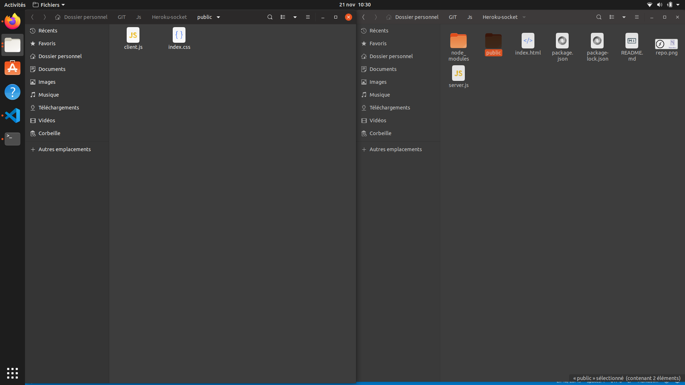
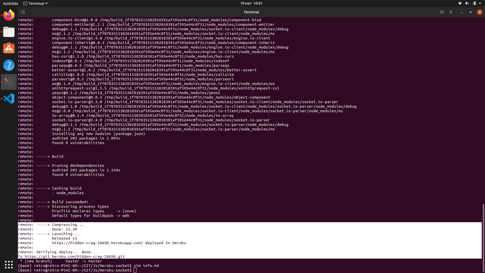

# Heroku-socket - Emissions

<p> :warning: A little thing I will let you know, <b>if you have not followed the construction guide of the starting environment, and you have download the repository </b>, you can skip the sections concerning Heroku, and above all do not forget to make a <b>npm install </b> in the root of the directory to install the dependecies of our project.</p>


<hr>


<h3>  :notebook: purpose of this branch </h3>

<p>On this branch we will take care of the following points : </p>

<p><i> :memo: Generate a random name to an user and register it in our server.</i></p>

<p><i> :memo: Notice all users when an user log in or log out. </i></p>

<p><i> :memo: Display list of users connected. </i></p>

<p><i> :memo: And finally, deploy our change on Heroku. </i> </p>

<p> Welcome on this branch, we gonna write the most importants functions of our applications, and also redefining a little bit our template elements organisation.</p>


<h3> :file_folder: Reorganization of our file. </h3>

<p> Well for my design i use <a href="https://getbootstrap.com/docs/4.3/layout/grid/"> Bootstrap </a> which is a responsive library, that should explain the following new line in our <a href="index.html">index.html</a></p>

``` html

 <link href="bootstrap-4.3.1-dist/css/bootstrap-grid.min.css" rel="stylesheet" type="text/css">

```  

<p> I don't gonna explain to you my CSS logic, because is not the objective of the repository, feel free to build your own design. </p>

<p>We would like to put our client script in a file and create a CSS file for our index, it would be more pleasant for us to store this in a folder, so we will create a public folder in the root of our project. </p>

<code> mkdir public </code><br>
<code> cd public </code><br>
<code> touch index.css && touch index.js </code><br>

<p>The important thing, is that your structure looks like this: </p>



<p> This beautiful new structure requires some modifications to our server.js file, let me show you what's new : </p>

``` javascript

'use strict';


// Nothing change before this...


process.env.PWD = process.cwd();
const PORT = process.env.PORT || 3000;
const server = express()

// When user is try to get the root of our application, we send index.html as template
.get('/', function(req,res){
  res.sendFile(__dirname + '/index.html');
})

// And we provide a folder to use named as 'public' who contains our client.js and index.css
.use(express.static(path.join(process.env.PWD, 'public')))


.listen(PORT, () => console.log(`Listening on ${ PORT}`))

const io = socketIO(server);

// Nothing change after this...

```

<p> I hope the comments has been helpful so everything is say. If your lost take a look on <a href="server.js" target="_blank">server.js</a>.</p>

<p>In the file <a href="https://github.com/R3tr093/Heroku-socket/blob/emissions/public/client.js" target="_blank"> client.js </a>, copy the javascript of the index.html, and paste it into your client.js </p>

<p><i> You have to copy / paste this : </i></p>

<h4> client.js </h4>

``` javascript

var socket = io();

var el = document.getElementById('server-time');


socket.on('time', function(timeString) {
    el.innerHTML = 'Server time: ' + timeString;
});

socket.on('hello', function(message){
  document.getElementById('serverMessages').textContent = "" + message.content;
  document.getElementById('amountUsers').textContent = "Users connected : " + message.amount;

})

``` 

<p> Nothing to explain about this, now we will proceed to some modification of our <a href="index.html" target="_blank">index.html</a> </p>

<p>We want to remove the script we refactor in client.js, and change template a little bit for working in. ( In my case I choose to call Bootstrap as CDN for my responsive CSS, if you don't use it, you can delete the line who mention it into the <b>head</b>) </p>

<p> :warning: When you type the path of your index.css, or client.js, you don't have to mention <b><i>'public/index.css</i></b> you can just mention the name of your file so <b><i>'index.css'</i></b>

<h4> index.html </h4>

``` html

<html>

    <head>

        <link href="index.css" rel="stylesheet" type="text/css" >
        <link href="bootstrap-4.3.1-dist/css/bootstrap-grid.min.css" rel="stylesheet" type="text/css">
        
    </head>

  <body>

    <div class="d-none d-md-block col-1" id="usersList">

        <p id="amountUsers"></p>

    </div>
    

    <div class="container">
          
      <div class="row">
           

      
            <div class="col-lg-10 col-md-10 col-xs-12 col-sm-12" id="main">
               
                <p id='server-time'></p>
      
                <p id="serverMessages"></p>

                <hr>

                <p class="userMessages"><span class="users"> User say : </span> bla bla bla ! </p>
               
                

                
      
            </div>

      
      </div>
  
    </div>

  
    <!-- JAVASCRIPT -->
    
    <script src="/socket.io/socket.io.js"></script>
    <script src="client.js"></script>
  
</body>
</html>


```

<p> And finally, here my CSS, but you still can define your own style. </p>

<h4> index.css </h4>

``` css

body
{
    margin: 0px;
    height: 100vh;
    overflow: hidden;
    display: flex;
}

#main
{
  
  border: 1px solid black;
  text-align: center;

}

#userList
{
    position: absolute;
    left: 10px;
    top: 0vh;
    overflow-y: auto;
    width: 5%;

}

.userMessages
{
    text-align: left;
}


``` 


<p> After all theses changes, if you start the application you should see something like this : </p>



<p> For those who deploy on heroku, it is possible that the changes have compromised the integrity of our application, I advise you to push on the repository to verify that everything is fine.<br> If you followed the instructions I gave,  it should be fine.</p>

<code>git add . </code><br>
<code>git commit -m " New structure " </code><br>
<code>git push heroku master</code>

<hr>

<h3> :registered: Generate an random name for each users, and announce a new arrival on the chat </h3>

<hr>

<br>

<p> In our server.js we add the following line : </p>

<p>First we will create two arrays that will allow us to generate random nicks, I chose the following values ​​but free to you to resort to more creativity for this step.</p>

<code>let nameList = ["Strawberry","Pineapple","Pink","Tiger","Wolf","Hero","Legend","Otter","Kitten"];</code><br>
<code> let nameStuffList = ["Angry","Anxious","Curious","Sleeping","Incredible","Tiny","Big","Invisible"];</code><br>

<p>As long as you are also creating an empty array that will contain all the nicks.</p>

<code> let users = [];</code><br>

<p>Now we need a function to return a random number from a range, so easy : </p>

```javascript

function getRandomInt(max) {
  return Math.floor(Math.random() * Math.floor(max));
}

```


<p>:warning: Disclaimer, the following solution is absolutely not the best, but it work for our project because we just want to practice with socket.io, if you want something more efficient use a database, or another good solution is <a href="https://www.npmjs.com/package/express-socket.io-session" target="_blank"> express-socket.io-session </a></p>

<p>Now let's see how we are going to use our Array to provide usernames, and warn users of logins / logouts. </p>

```javascript

'use strict';

const express = require('express');
const socketIO = require('socket.io');
const ent = require('ent');

const path = require('path');

process.env.PWD = process.cwd();
const PORT = process.env.PORT || 3000;
const server = express()


.get('/', function(req,res){
  res.sendFile(__dirname + '/index.html');
})

.use(express.static(path.join(process.env.PWD, 'public')))


.listen(PORT, () => console.log(`Listening on ${ PORT}`))

const io = socketIO(server);


let amountUser = 0;

let hello = "Hello, welcome on our chat service have a good talking !";

// Server provide a random name :

let nameList = ["Strawberry","Pineapple","Pink","Tiger","Wolf","Hero","Legend","Otter","Kitten"];

let nameStuffList = ["Angry","Anxious","Curious","Sleeping","Incredible","Tiny","Big","Invisible"];

let users = [];

function getRandomInt(max) {

  return Math.floor(Math.random() * Math.floor(max));

}


io.on('connection', (socket) => {
  
  // Provide random userName, and push it into an array.

  let userName = nameStuffList[getRandomInt(nameStuffList.length)]

  userName = userName + nameList[getRandomInt(nameList.length)]

  userName = userName + String(getRandomInt(999))

 // Ensure we can't get two equals userName. ( Even if the probability is really weak ! )
  for (let i = 0; i < users.length; i++) {
    
    if(users[i] === userName)
      {
        userName = nameStuffList[getRandomInt(nameStuffList.length)]

        userName = userName + nameList[getRandomInt(nameList.length)]

        userName = userName + String(getRandomInt(999))
      }
  }

  socket.pseudo = userName;

  users.push(userName)

  hello = "Hello, your logged in as : " + userName + " welcome on our chat service have a good talking !";

 

  // Increment users amount 
  
  amountUser++;
  
  amountUser = String(amountUser)

  // Emit data with user name add new amountUser value to EVERYONE.
  io.emit("logOn",{content: userName, amount: amountUser })

  // Greetings to arrival for the client
  socket.emit("hello",hello)

  
  
  // Emit for the client an event newUser
  socket.emit("newUser",(socket.pseudo))

  // On client disconnection
  io.on('disconnect', () => {
  
  // Running the array and remove is name.  
  for (let i = 0; i < users.length; i++) {
    
    if(users[i] === userName)
      {
        users.pop(i);
      }
    }

    console.log(users)

  // Decrement user
  amountUser--;

  // Emit data with user name add new amountUser value to EVERYONE.
  io.emit("logOff",{ content: socket.pseudo, amount: amountUser })
  
  });

});


setInterval(() => io.emit('time', new Date().toTimeString()), 1000);

```

<p>  :astonished: The code has a lot to change ! Do not panic I leave comments that should put you on the track, but I will still explain each new line.</p>

<p> About the creation of a random user name, I have explained everything above, so let's go to the first line so I have not spoken yet.

<code>socket.pseudo = userName;</code><br>

<p>This is the way we keep the data, and that is a temporary solution to do our first steps on socket.io, but that would not be valid for a real project where you should rather resort to a database, or other as I have mentioned earlier.</p>

<p>The fact is that socket is an object to which I have added a userName property, which will be specific to each client because each client has its own socket instance.</p>

<p>Notice that, I also update the hello emission to display the userName.</p>

<code>hello = "Hello, your logged in as : " + userName + " welcome on our chat service have a good talking !";</code><br>

<p>This line emit a <b>" logOn "</b> event to every clients </p>

<code>io.emit("logOn",{content: userName, amount: amountUser })</code><br>

<p>I passed in the new amount of user, and the name of the new user who logged in. </p>
<p>We have to use theses data in our <b>index.html</b> later. </p>

<p>As you can see, i used <b>io.emit</b> instead of <b>socket.emit</b></p>

<p>Well remember that, socket.emit should emit for the specific client, and io.emit will broadcast to everyone. </p>

<p>By the code below, on the <b> disconnect </b> emission I run my array which contains all users and I remove the user  who has been disconnected. </p>

``` javascript

  // Running the array and remove is name.  
  for (let i = 0; i < users.length; i++) {
    
    if(users[i] === userName)
      {
        users.pop(i);
      }
    }

    console.log(users)

```

<p>Finally I broadcast that, an user has been disconnected with his name by the <b>logOff</b> emission.</p>

<code> io.emit("logOff",{ content: socket.pseudo, amount: amountUser })}); </code><br>

<p><i>Don't be afraid we don't change the <b> client.js </b> so much !  :sweat_smile: </i></p>

<hr>

<h3> client.js</h3>

<hr>

<p>