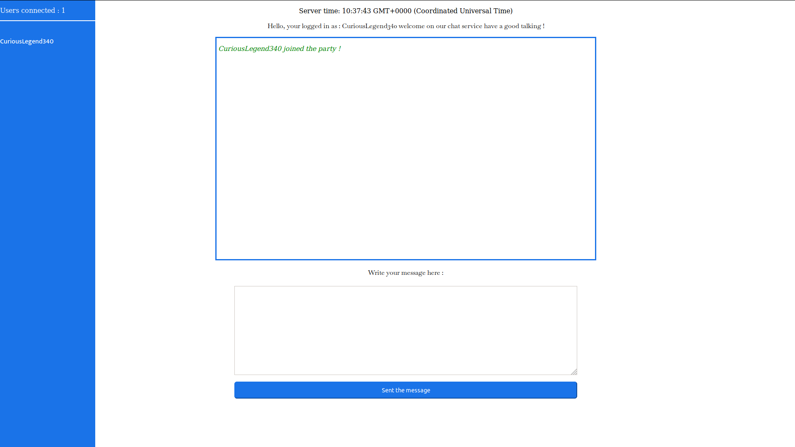

# Heroku-socket - Connections

<p> :warning: A little thing I will let you know, <b>if you have not followed the construction guide of the starting environment, and you have download the repository </b>, you can skip the sections concerning Heroku, and above all do not forget to make a <b>npm install </b> in the root of the directory to install the dependecies of our project.</p>


<hr>

<h3>  :notebook: purpose of this branch </h3>

<p>On this branch we will take care of the following points : </p>

<p><i> :memo: Reacting to the arrival of a user. </i></p>

<p><i> :memo: Display a greeting in our client template. </i></p>

<p><i> :memo: Display an account of the total number of users connected. </i></p>

<p><i> :memo: And finally deploy our changes on Heroku. </i></p>


<p>Here we will see how to connect socket.io and synchronize our client with our server. </p>

<p> This part will be more informative than the previous one, I will try to explain each new line of code, to understand how socket.io works line by line, we already have a good example of that, let's take a first look on our <a href="server.js" target="_blank">server.js</a> file. </p>

<p> If you missing some informations, take a look on <a href="https://socket.io/docs/server-api/#Server"> socket.io documentation </a></p>


<h3> :computer: Understanding how work our socket server side. </h3>

``` javascript

'use strict';

const express = require('express');
const socketIO = require('socket.io');
const path = require('path');

const PORT = process.env.PORT || 3000;
const INDEX = path.join(__dirname, 'index.html');

const server = express()
  .use((req, res) => res.sendFile(INDEX) )
  .listen(PORT, () => console.log(`Listening on ${ PORT }`));

const io = socketIO(server);

io.on('connection', (socket) => {
  

  socket.on('disconnect', () => console.log('Client disconnected'));
});


setInterval(() => io.emit('time', new Date().toTimeString()), 1000);

```

<p> About the line who said : </p>

<code> const path = require('path'); </code><br>
<code> const socketIO = require('socket.io'); </code><br>
<code> const path = require('path'); </code><br>

<p> They import the modules we need and keep them in constants, which we will use to use the features of these modules. </p>

<hr>

<code> const PORT = process.env.PORT || 3000; </code> <br>
<code> const INDEX = path.join(__dirname, 'index.html');</code> <br>

<p> Store in two constants, on the one hand the port of entry of our server, which will be either process.env for heroku and for us in local the port 3000. <br>

and on the other hand the path to our template index.html </p>

<hr>

``` javascript

const server = express()
  .use((req, res) => res.sendFile(INDEX) )
  .listen(PORT, () => console.log(`Listening on ${ PORT }`));

```

<p> These lines of codes simplified way, allow to load our file index.html as template client when a client will arrive on our application. </p>

<hr>

<code> const io = socketIO(server); </code>

<p> Simplified way anytime, this line generates an instance of socket.io for our server which is passed to it as parameter </p>

``` javascript

io.on('connection', (socket) => {
  
  console.log("Client connected")

  socket.on('disconnect', () => console.log('Client disconnected'));
});

``` 

<p>Contains the instructions to produce when a client connects or disconnect to our server. </p>

<hr>

<code>setInterval(() => io.emit('time', new Date().toTimeString()), 1000);</code>

<p> this one is the main course, the setInterval function takes two parameters the first one is the instruction set that we have to execute, the second the time sequence to which this instruction set must be executed, in our case it will be 1000, in other words every second. </p>

<p>The first parameter we passed asks socket.io to emit an event time, which will retrieve the current date (from our server) to our client file <i>(index.html)</i> </p>

<p>Thanks to this, we managed to display the server time in the client template.</p>

<h3>  :construction_worker: Our first work ! </h3>

<p> We're ready to work on the server side, Our first priority is to provide a welcome message every time a user arrives on our chat. What will fill two birds with one stone, the objectives : </p>

<p><i> :memo: Reacting to the arrival of a user. </i></p>

<p><i> :memo: Display a greeting in our client template. </i></p>

``` javascript

let hello = "Hello, welcome on our chat service have a good talking !"

io.on('connection', (socket) => {
  
  io.emit("hello",hello)

  socket.on('disconnect', () => console.log('Client disconnected'));
});

```

<p> You probably notice that, we add two lines who mention : </p>

<code>let hello = "Hello, welcome on our chat service have a good talking !" </code>

<p> Our variable with the gretting message we want to send, we also can use an array with many different messages or something, but it work for our simple example. </p>

<code> io.emit("hello",hello) </code>

<p> That means when a connection to the socket is issued, I want you to emit an event called hello and take as value to send fro the client my variable named hello also.</p>

<p>Now let's look how the client side can get this data and use it. </p>

<p> Let's add two line on the client side <a href="index.html" target="_blank">(index.html)></a></p>

``` html

<html>
  <body>
    <p id='server-time'></p>

    <p id="serverMessages"></p>
    
    <script src="/socket.io/socket.io.js"></script>
    
    <script type="text/javascript">
    

      var socket = io();

      var el = document.getElementById('server-time');


      socket.on('time', function(timeString) {
          el.innerHTML = 'Server time: ' + timeString;
      });

      socket.on('hello', function(message){
        document.getElementById('serverMessages').textContent = "" + message;
      })


    
    
    </script>
  
</body>
</html>

```

<p> We added a ' p ' tag with the id : serverMessages, he will contain our messages from the server, exactly the sameway we use to display server time. </p>

``` html
<p id="serverMessages"> </p> </code>
```

<p> And here the few lines who make us able to get information from backend : </p>

``` javascript

      socket.on('hello', function(message){
        document.getElementById('serverMessages').textContent = "" + message;
      })

``` 

<p> Our socket object uses the <b>on</b> method to listen to an event that is passed as the first parameter of the method, in other words <i>'hello'</i>, it takes as second parameter an anonymous function that will take as parameter the values ​​sent by our backend, so, message contains the values passed in parameters of the function socket.emit ('hello') that we defined a few moments ago in our server.js file </p>

<p> If you restart your project with theses new lines, you should see the message we wanted to send just below the server time. </p>



<p>Well we succesfully reacting to the arrival of a user , and  Displayed a greeting in our client template. </p>