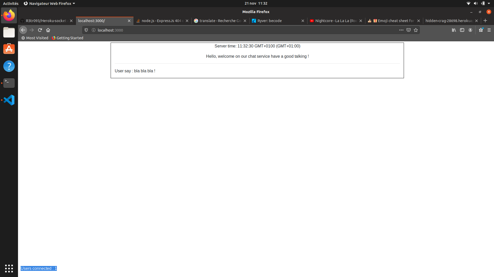

# Heroku-socket


<hr>

<p> Hello, this repository talking about how to deploy and build a chat service working with <b>socket.io</b> on Heroku.</p>

<p>Final state of project : <a href="https://hidden-crag-28698.herokuapp.com/" target="_blank">socket.io, heroku chat. </a></p>


<p>Don't want to create all the chat ? You can deploy on Heroku the complete chat on the branch  : <a href="https://github.com/R3tr093/Heroku-socket/tree/takeaway" target="_blank">takeway </a></p>

<p> You should find some files with the <b>.md</b> extension for every upgrade, this readme will guide you to deploy your starting environment, but for that, there is some knowledges to have on <b>Javascript</b>, <b>NodeJS</b> and <b>NPM</b>, I will provide you all the informations you need into this repository about socket.io </p>

<h3> :question: - What do you really need to know? </h3>

<br>

<ul>

<li> :thumbsup: The basics of Javascript</li>
<li> :thumbsup: The basics of Github</li>
<li> :thumbsup: The use of Node to create a backend, in our case with the help of express.</li>
<li> :thumbsup: Dependency management and what is a package.json</li>
<br><br>
<p><i> That's suppose you already installed Node and NPM on your computer, but if you wondering where you can get NodeJS, follow the link below.</i></p>
<p><i> :link: <a href="https://www.npmjs.com/get-npm" target="_blank">Download NodeJS and NPM </a> </i></p>


</ul>

<p> :hand: You also gonna need a heroku account, you can register yourself here <a href="https://signup.heroku.com/" target="_blank"> Register on Heroku </a></p>

<p>
Using <b>Heroku CLI</b> is really helpfull when you deploy your project on Heroku, I strongly recommend to use it, and in this tutorial all the instructions about deployement is made on the Heroku CLI, you can get the Heroku CLI by the command below.</p>

<code>sudo snap install --classic heroku </code>

<p> If your not using a Linux OS, I let you find an equals solution who make sense to you, you probably should take a look on <a href="https://devcenter.heroku.com/articles/heroku-cli" target="_blank"> Heroku CLI documentation</a>.</p>

<p> Here the documentation i followed to write this guide, which is more a reminder for myself, but whatever. </p>
<br>

<p><i>:link: <a href="https://devcenter.heroku.com/articles/node-websockets" target="_blank">Heroku - Websocket </a></i></p>

<p>:warning: For persistance of data, I made the choice to use arrays, it's a little pass-pass, which is not suitable for a real chat service, but allows us to do some tests with socket.io </p>

<p>Also i don't want to require knowledge about MongoDB or something like that for following this repository, but you're free to provide your own persistance of data system, i'll gave you some tips to doing it later.</p>
<br>


# Let's deploy !


<p> Create a directory for your application, I named my directory <i>Heroku-socket </i> feel free to be more creative, and move into this directory.</p>

<p>Our first command  is : </p>

<code> npm init -y </code>

<p> Once this command is complete, you get a file named  <b>package.json</b> into your directory. </p>

<p> Now open your package.json with your favorite text editor, find the array " scripts " and add the following line <br>

<code> "start": "node server.js" </code>

<p> Check your NodeJS version by the command below. </p>

<code> node -v </code>

<p>Also, you should insert this array.</p>
 
<code>
"engines": {
  "node": "12.13.0"
}
</code>

<p> <i><b> :warning: And into it mention your own node version.</b></i> </p>

<br>

<p>Your package.json should look like this. </p>

```javascript

{
  "name": "Heroku-socket",
  "version": "1.0.0",
  "description": "",
  "main": "index.js",
  "engines": {
    "node": "12.13.0"
  },
  "scripts": {
    "test": "echo \"Error: no test specified\" && exit 1",
    "start": "node server.js"
  },
  "repository": {
    "type": "git",
    "url": "git+https://github.com/R3tr093/Heroku-socket.git"
  },
  "keywords": [],
  "author": "",
  "license": "ISC",
  "bugs": {
    "url": "https://github.com/R3tr093/Heroku-socket/issues"
  },
  "homepage": "https://github.com/R3tr093/Heroku-socket#readme"
}

```

<p>Ok, it's enough for the package.json, now, we have to create two files in the root of our directory, named as <b>index.html</b> and <b>server.js</b></p>

<h3> :link: Install dependencies </h3>

<p>  :raised_hand: Before writing our code in theses files we will need some dependencies. </p>

<p>Open your terminal and type the instructions below </p>

<code>npm install --save express socket.io</code>

<p>Once this command is done, express and socket.io will be added to your dependencies into your package.json </p>

<h3> :link: Write first piece of code.</h3>

<hr>


<hr>

<h3> index.html </h3>

```html
<p id='server-time'></p>
    
    <script src="/socket.io/socket.io.js"></script>
    
    <script>
      var socket = io();
      var el = document.getElementById('server-time');
      socket.on('time', function(timeString) {
        el.innerHTML = 'Server time: ' + timeString;
      });
    
    </script>
  
</body>
</html>
```

<hr>

<h3> server.js </h3>

```javascript
'use strict';

const express = require('express');
const socketIO = require('socket.io');
const path = require('path');

const PORT = process.env.PORT || 3000;
const INDEX = path.join(__dirname, 'index.html');

const server = express()
  .use((req, res) => res.sendFile(INDEX) )
  .listen(PORT, () => console.log(`Listening on ${ PORT }`));

const io = socketIO(server);

io.on('connection', (socket) => {
  console.log('Client connected');
  socket.on('disconnect', () => console.log('Client disconnected'));
});

setInterval(() => io.emit('time', new Date().toTimeString()), 1000);
```

# :tada: First look ! 

<p>You can now test your application by running the node server.js command in your terminal. </p>

<code> npm start && node server.js </code>

<p>Your terminal must remain active and will stop and display information from the server,<br> when you open your browser to the address <a href="http://localhost:3000/" target="_blank">localhost: 3000</a> you will see your application running !</p>

 <p>Also in your terminal a message appears indicating that " client connected " .<br>
If you log off, and close the page, you will get a message stating that a client is offline.</p>

 <p>For now, nn client side, you can see the date time of your server.</p>


<p>Now we want to send our little application that will serve as a starting point for our chat on Heroku, is very simple and very short!</p>

# :rocket: Deploy on Heroku

<p> For this part, we suppose you already have installed Heroku CLI </p>


<code> heroku create </code>
<p><i> In this case, the name of your application is randomly generated and return an url such as https://hidden-crag-28698.herokuapp.com/ </i> </p>

<p><b>OR</b></p>

<code> heroku create example </code>
<p><i> In this case <i>"example"</i> is the name you want to provide to your application. This will return an url such as https://example.herokuapp.com/</i> </p>


<p>That should create an application on Heroku and return to you the URL where you can find your application, you also get an url for the repository of your new application.</p> 

<p>Let's follow with :  </p>

<code> git commit -am 'socket.io starting point' </code>

<br>

<p><i> Do a simple commit. </i></p>

<code>git push heroku master</code>

<p><i>This command, push your directory into the heroku repository of your application. </i></p>

<p> At the end of this command you should see something like this : </p>



#  :clap: Basic structure done !

<p> Now you have a basic structure to transform into an awesome chat service ! </p>

<p> You can find the state of the basic structure repository on the branch named <i><a href="https://github.com/R3tr093/Heroku-socket/tree/base">base </a></i>  </p>

<h3>  :question: And now ... ? </h3>

<p> You are free to continue by yourself or ... <br>
 If you want to continue this project with me, you can go to the branch called <i><a href="https://github.com/R3tr093/Heroku-socket/tree/connections">connections </a></i> . </p>

 <p> In this branch I will give you more informations about the meaning of our starter code, and guide you to build the very first step of your chat services.</p>
